# Práctica 1 Interfaces Inteligentes: Introducción C#

* **Autor:** Bruno Morales Hernández - alu0101664309@ull.edu.es
* **Fecha:** 05/10/2026
* **Versión de Unity:** Unity 6.5

---

## Descripción General
Esta entrega se centra en la resolución de los trece ejercicios de la práctica para adquirir los conocimientos y fundamentos esenciales de Unity. Se trabaja la estructura básica de los scripts y su ciclo de vida (`Start` y `Update`), la configuración de variables desde el Inspector, el cálculo matemático mediante `Vector3`, la interacción con componentes del motor como `Transform` y `Renderer`, el tratamiento de la entrada del usuario (teclado e *Input Manager*) y la cinemática de objetos mediante traslación y rotación, incluyendo la independencia del movimiento respecto a los fotogramas por segundo.

---

## Estructura del Repositorio

El repositorio contiene el proyecto de Unity filtrado para omitir archivos temporales y librerías autogeneradas (`Library/`, `Temp/`, `.vscode/`):

```text
├── Assets/
│   ├── Scenes/
│   └── Scripts/
│       ├── ej1-ColorChanger.cs
│       ├── ej2-Vector.cs
│       ├── ej3-Posicion.cs
│       ├── ej4-Distancia.cs
│       ├── ej5-MarcadorPosiciones.cs
│       ├── ej6-Velocidad.cs
│       ├── ej7-disparo.cs
│       ├── ej8-MovimientoCubo.cs
│       ├── ej9-ControlTeclado.cs
│       ├── ej10-ControlTecladoDelta.cs
│       ├── ej11-PerseguirEsfera.cs
│       ├── ej12-MirarYPerseguir.cs
│       └── ej13-AvanceYGiro.cs
├── Packages/
│   ├── manifest.json
│   └── packages-lock.json
├── gifs/
│   ├── ej1.gif
│   ├── ej2.gif
│   ├── ej3.gif
│   ├── ej4.gif
│   ├── ej5.gif
│   ├── ej6.gif
│   ├── ej7.gif
│   ├── ej8.gif
│   ├── ej8a.gif
│   ├── ej8b.gif
│   ├── ej8c.gif
│   ├── ej8d.gif
│   ├── ej8e.gif
│   ├── ej9.gif
│   ├── ej10.gif
│   ├── ej11.gif
│   ├── ej12.gif
│   └── ej13.gif
├── .gitignore
└── README.md
```

---

## Hitos Relevantes y Ejercicios Realizados

### Ejercicio 1: Modificación de color cada N frames
* **Script:** `ej1-ColorChanger.cs`
* **Descripción:** Se define un array de 3 posiciones (`float[]`) para representar los canales de color (R, G, B) con valores iniciales entre 0.0 y 1.0. Mediante un contador en el método `Update()`, cada vez que transcurre el número de fotogramas establecido por el usuario en el Inspector (`_intervaloFrames`), se escoge un canal al azar con `Random.Range` y se le asigna un nuevo valor mediante `Random.value`. El color resultante se aplica al material a través del componente `Renderer`.
* **Prueba de ejecución:**


---

### Ejercicio 2: Operaciones matemáticas con Vector3
* **Script:** `ej2-Vector.cs`
* **Descripción:** Asociado a la esfera, define dos vectores tridimensionales públicos editables desde el Inspector de Unity. En el inicio de la simulación calcula y serializa en el Inspector:
  * Magnitud de cada vector (`Vector3.magnitude`).
  * Ángulo que forman entre sí (`Vector3.Angle`).
  * Distancia euclídea entre ambos (`Vector3.Distance`).
  * Comparación lógica para determinar cuál de ellos posee mayor cota en el eje de altura ($Y$).
* **Prueba de ejecución:**


---

### Ejercicio 3: Lectura de la posición en el mundo
* **Script:** `ej3-Posicion.cs`
* **Descripción:** Recupera y muestra por consola y en el Inspector la posición tridimensional de la esfera en el escenario, contrastando las dos vías sugeridas por la API de Unity:
  * Acceso directo a la propiedad de conveniencia: `transform.position`.
  * Búsqueda explícita del componente en el GameObject: `GetComponent<Transform>().position`.
* **Prueba de ejecución:**


---

### Ejercicio 4: Radar de distancias a otros GameObjects
* **Script:** `ej4-Distancia.cs`
* **Descripción:** El script, vinculado a la esfera, localiza el objeto `Cube` y el objeto `Cylinder` presentes en la escena utilizando `GameObject.Find` o `GameObject.FindWithTag`. Posteriormente extrae sus componentes `Transform` y calcula la distancia euclídea que separa a la esfera de cada uno de ellos mediante `Vector3.Distance`, visualizándose tanto en la consola como en campos del Inspector.
* **Prueba de ejecución:**


---

### Ejercicio 5: Desplazamiento relativo mediante entrada de teclado
* **Script:** `ej5-MarcadorPosiciones.cs`
* **Descripción:** Los objetos de la escena registran su posición original en el método `Start()` y exponen un vector de desplazamiento (`Vector3`) configurable desde el Inspector. Al detectar la pulsación de la barra espaciadora mediante `Input.GetAxis("Jump")`, se suma dicho vector a la posición inicial, reubicando las entidades de forma instantánea.
* **Prueba de ejecución:**

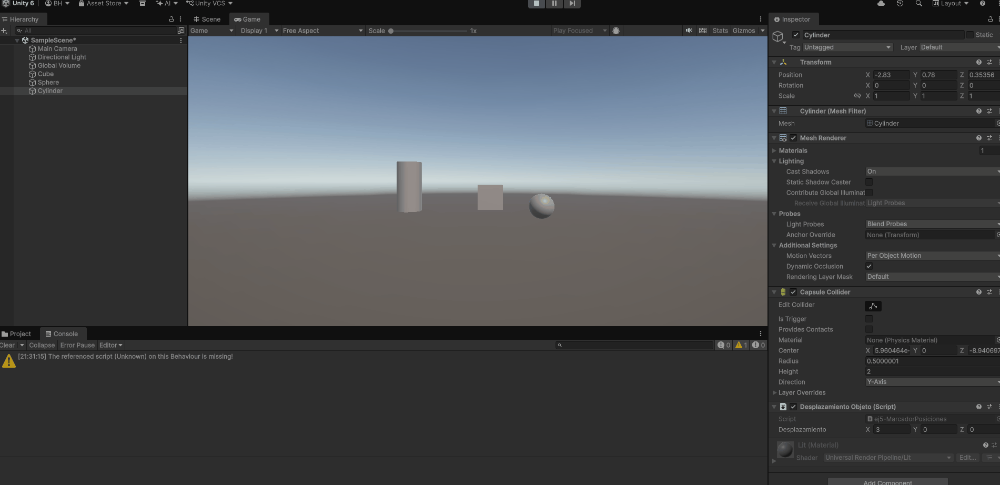

---

### Ejercicio 6: Monitorización de velocidad y multiplicación de ejes
* **Script:** `ej6-Velocidad.cs`
* **Descripción:** Asignado a un cubo con un campo público `velocidad`. Al presionar las flechas de dirección (`KeyCode.UpArrow`, `DownArrow`, `LeftArrow`, `RightArrow`), se captura el valor de los ejes virtuales `Horizontal` y `Vertical` mediante `Input.GetAxis()`. Se muestra por consola el resultado de multiplicar la velocidad por ambos ejes, anteponiendo siempre el nombre de la tecla de flecha accionada.
* **Prueba de ejecución:**

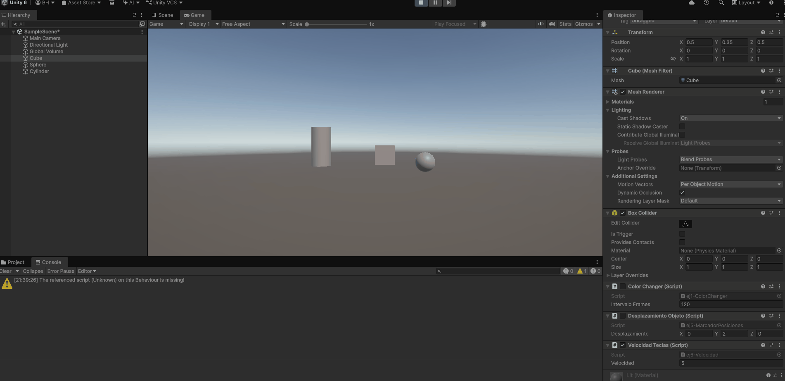

---

### Ejercicio 7: Mapeo de acción virtual en el Input Manager
* **Script:** `ej7-disparo.cs`
* **Descripción:** Se configura una nueva entrada en el Input Manager (`Edit -> Project Settings -> Input Manager`) denominada `disparo`, vinculada al botón positivo `h`. Mediante el método `Input.GetButtonDown("disparo")`, el script detecta la acción desacoplada del teclado físico y emite un mensaje de confirmación en la consola.
* **Prueba de ejecución:**

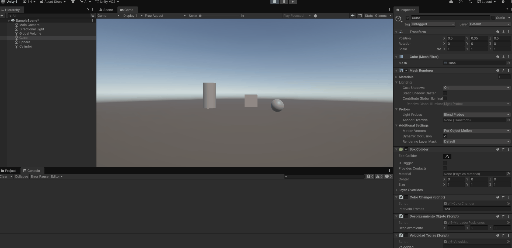

---

### Ejercicio 8: Traslación continua y análisis de variantes cinemáticas
* **Script:** `ej8-MovimientoCubo.cs`
* **Descripción:** El cubo traslada su posición de forma continua en cada frame utilizando `transform.Translate(moveDirection * speed)`. Se parte de una velocidad inicial mayor que 1 y una altura inicial $y = 0$.
* **Prueba de ejecución general:**

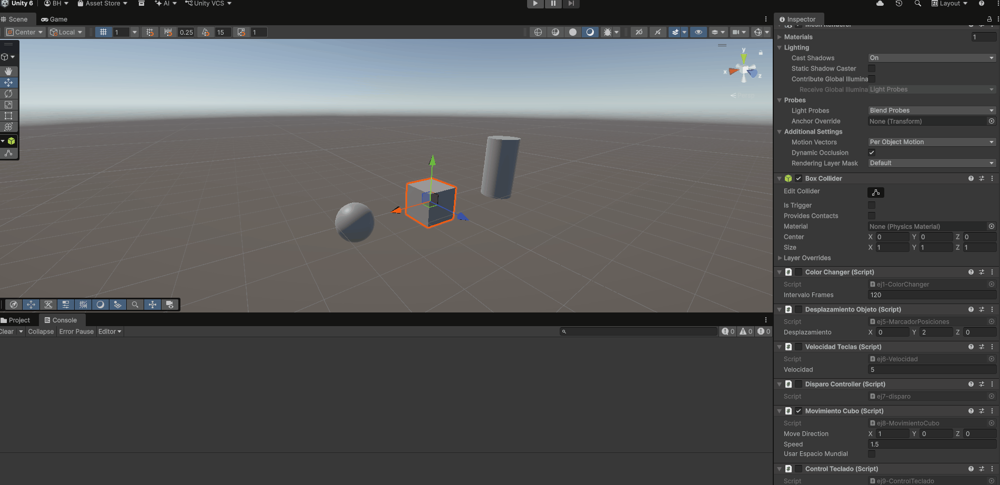

* **Análisis de variantes experimentales:**
  * **a. Duplicar coordenadas de la dirección del movimiento (`moveDirection`):** Al duplicar las componentes del vector (por ejemplo, pasando de $(1, 0, 0)$ a $(2, 0, 0)$), se duplica su magnitud euclídea. Como el desplazamiento aplicado es directamente proporcional a dicha magnitud, el cubo avanza al doble de velocidad.

    

  * **b. Duplicar la velocidad manteniendo la dirección:** Al multiplicar el escalar `speed` por dos manteniendo el vector unitario, el producto vectorial resultante ($2 \cdot \vec{d} \cdot s$) es matemáticamente idéntico al apartado anterior. El cubo experimenta exactamente la misma aceleración visual.

    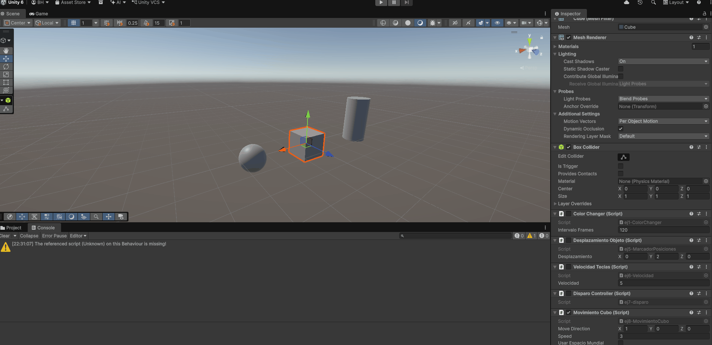

  * **c. Velocidad menor que 1:** Al asignar valores fraccionarios (ej. $0.2$), el desplazamiento aplicado por iteración se reduce considerablemente, produciendo un avance muy lento.

    

  * **d. Posición inicial con cota $y > 0$:** El objeto realiza la misma traslación en el plano horizontal, pero manteniéndose suspendido en el aire a la altura asignada, ya que el vector de movimiento no introduce variación en el eje vertical.

    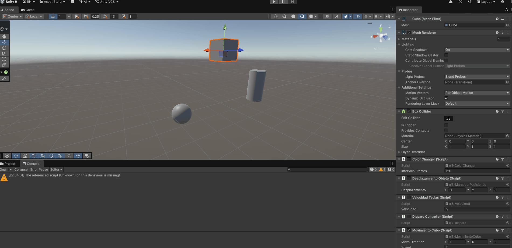

  * **e. Movimiento en espacio Local vs Espacio Mundial:** Al rotar el cubo sobre su eje vertical (ej. $45^\circ$), se aprecia la diferencia entre sistemas de referencia: en espacio local (`Space.Self`), el cubo avanza siguiendo la orientación de su propio eje frontal; en espacio mundial (`Space.World`), ignora su rotación y se traslada estrictamente a lo largo del eje global del escenario.

    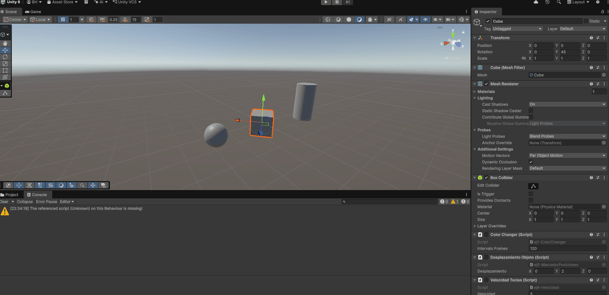

---

### Ejercicio 9: Control independiente de entidades por teclado
* **Script:** `ej9-ControlTeclado.cs`
* **Descripción:** Implementa un control diferenciado para dos entidades en escena sin colisión de ejes virtuales. El cubo procesa las flechas de dirección del teclado para traslaciones horizontales y verticales, mientras que la esfera responde a las teclas W-A-S-D. Ambos objetos avanzan a una velocidad constante parametrizable.
* **Prueba de ejecución:**

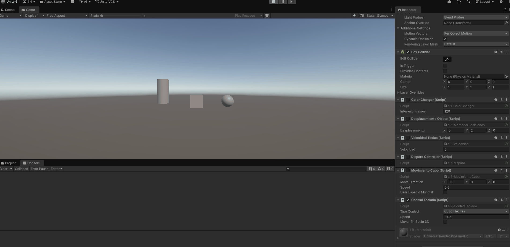

---

### Ejercicio 10: Independencia de fotogramas mediante Time.deltaTime
* **Script:** `ej10-ControlTecladoDelta.cs`
* **Descripción:** Adapta el esquema de control del ejercicio 9 multiplicando el vector de desplazamiento por `Time.deltaTime`. Esto desacopla el movimiento de la tasa de refresco (FPS) del monitor o del hardware, convirtiendo la velocidad en unidades de espacio recorridas por segundo en tiempo real y garantizando un avance homogéneo.
* **Prueba de ejecución:**

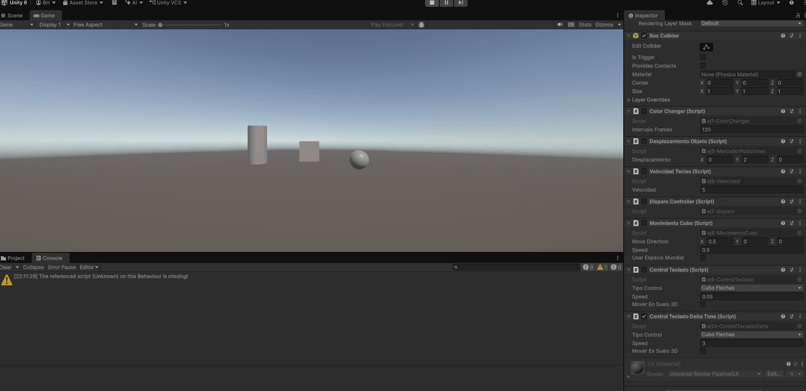

---

### Ejercicio 11: Persecución hacia objetivo con vector normalizado
* **Script:** `ej11-PerseguirEsfera.cs`
* **Descripción:** El script calcula el vector que une al cubo con la esfera ($\vec{v} = \vec{p}_{\text{esfera}} - \vec{p}_{\text{cubo}}$). Se anula la componente $y$ para fijar la altura del cubo y se normaliza el vector resultante (`.normalized`), asegurando que la velocidad de persecución sea estrictamente constante e independiente de la distancia a la que se encuentre la esfera.
* **Prueba de ejecución:**

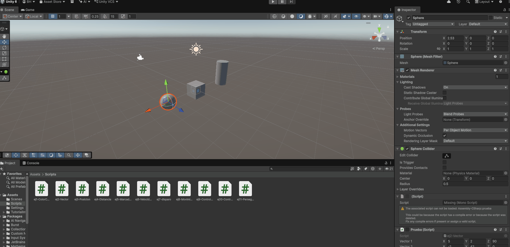

---

### Ejercicio 12: Orientación con LookAt y traslación frontal
* **Script:** `ej12-MirarYPerseguir.cs`
* **Descripción:** Adapta la persecución del ejercicio anterior orientando activamente el eje Z positivo del cubo hacia la esfera mediante el método `transform.LookAt()`. Para evitar cabeceos o inclinaciones indeseadas, se proyecta la posición de la esfera a la altura actual del cubo. Una vez encarado el objetivo, el cubo se traslada hacia su frente en coordenadas locales (`Vector3.forward`).
* **Prueba de ejecución:**

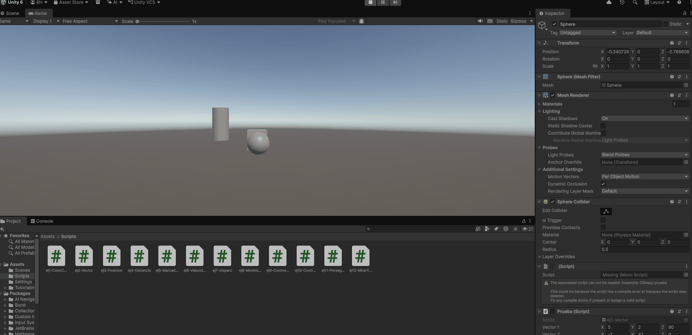

---

### Ejercicio 13: Giro horizontal y avance continuo con rayo de depuración
* **Script:** `ej13-AvanceYGiro.cs`
* **Descripción:** Implementa una cinemática de avance continuo hacia el frente del objeto (`transform.forward`). La entrada del eje `Horizontal` se utiliza exclusivamente para rotar la orientación del objeto sobre su eje $Y$ (`transform.Rotate`). Se incluye una línea de depuración en tiempo real proyectada desde la posición del cubo mediante `Debug.DrawRay` para visualizar en todo momento la dirección hacia adelante.
* **Prueba de ejecución:**

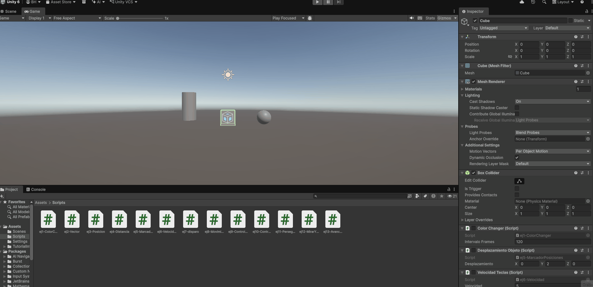

---

## Instrucciones de Prueba
1. Abrir el proyecto en Unity (asegurarse de que en `Project Settings -> Player` el `Active Input Handling` esté configurado en `Input Manager (Old)` o `Both`).
2. Cargar la escena principal de pruebas (`SampleScene`).
3. Comprobar la presencia de los objetos `Cube`, `Sphere` y `Cylinder` en la jerarquía.
4. Pulsar el botón `Play` y verificar las diferentes interacciones:
   * **Barra espaciadora:** Activa el salto relativo de posición en las entidades (Ejercicio 5).
   * **Flechas de dirección:** Desplazan el cubo y emiten los valores calculados por consola (Ejercicios 6 y 9).
   * **Tecla H:** Detona la acción de disparo configurada en el Input Manager (Ejercicio 7).
   * **Teclas W-A-S-D:** Controlan el desplazamiento de la esfera para evaluar el seguimiento y encarado del cubo (Ejercicios 9 a 12).
   * **Teclas A-D / Flechas Horizontales:** Rotan el cubo en tiempo real mientras este avanza continuamente proyectando el rayo de depuración rojo (Ejercicio 13).
