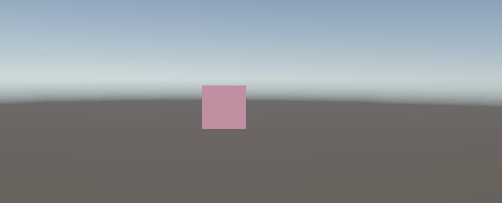
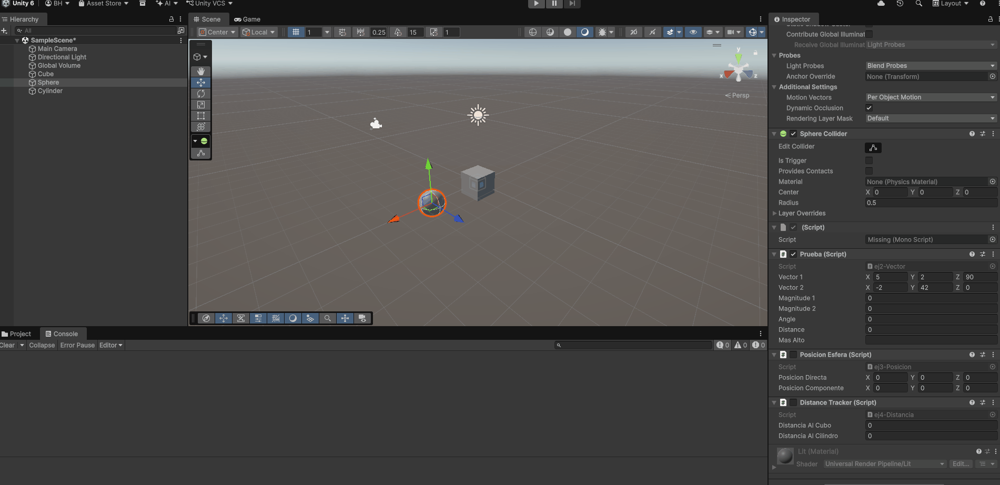
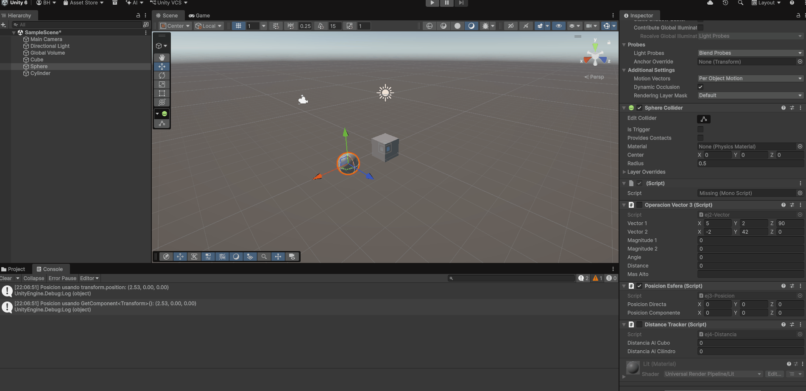
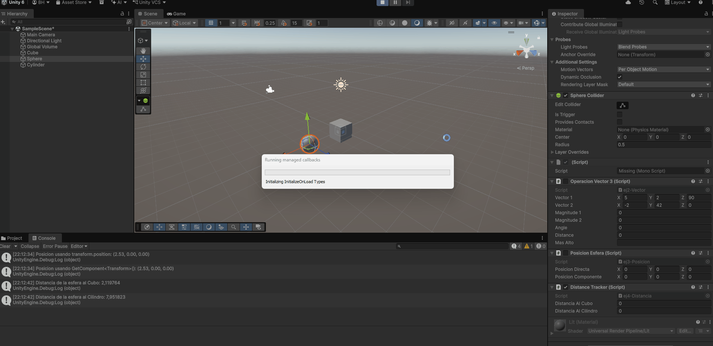

# Práctica 1 Interfaces Inteligentes: Introducción C#

* **Autor:** Bruno Morales Hernández - alu0101664309@ull.edu.es
* **Fecha:** 28/09/2026
* **Versión de Unity:** Unity 6.5

---

## Descripción General
Esta entrega se centra en la resolución de los cuatro primeros ejercicios de la práctica para adquirir los conocimientos y fundamentos esenciales de Unity antes de abordar las siguientes sesiones. En ellos se trabaja la estructura básica de los scripts y su ciclo de vida (Start y Update), la configuración de variables desde el Inspector, el cálculo matemático mediante Vector3 y la interacción con componentes del motor como Transform y Renderer.

---

## Estructura del Repositorio

El repositorio contiene el proyecto de Unity filtrado para omitir archivos temporales y librerías autogeneradas (`Library/`, `Temp/`, `.vscode/`):

```text
├── Assets/
│   ├── Scenes/
│   └── Scripts/
│       ├── ej1-ColorChanger.cs
│       ├── ej2-Vector.cs
│       ├── ej3-Posicion.cs
│       └── ej4-Distancia.cs
├── Packages/
│   ├── manifest.json
│   └── packages-lock.json
├── gifs/
│   ├── ej1.gif
│   ├── ej2.gif
│   ├── ej3.gif
│   └── ej4.gif
├── .gitignore
└── README.md
```

---

## Hitos Relevantes y Ejercicios Realizados

### Ejercicio 1: Modificación de color cada N frames
* **Script:** `ej1-ColorChanger.cs`
* **Descripción:** Se define un array de 3 posiciones (`float[]`) para representar los canales de color (R, G, B) con valores iniciales entre 0.0 y 1.0. Mediante un contador en el método `Update()`, cada vez que transcurre el número de fotogramas establecido por el usuario en el Inspector (`_intervaloFrames`), se escoge un canal al azar con `Random.Range` y se le asigna un nuevo valor mediante `Random.value`. El color resultante se aplica al material a través del componente `Renderer`.
* **Prueba de ejecución:**



---

### Ejercicio 2: Operaciones matemáticas con Vector3
* **Script:** `ej2-Vector.cs`
* **Descripción:** Asociado a la esfera, define dos vectores tridimensionales públicos editables desde el Inspector de Unity. En el inicio de la simulación calcula y serializa en el Inspector:
  * Magnitud de cada vector (`Vector3.magnitude`).
  * Ángulo que forman entre sí (`Vector3.Angle`).
  * Distancia euclídea entre ambos (`Vector3.Distance`).
  * Comparación lógica para determinar cuál de ellos posee mayor cota en el eje de altura ($Y$).
* **Prueba de ejecución:**



---

### Ejercicio 3: Lectura de la posición en el mundo
* **Script:** `ej3-Posicion.cs`
* **Descripción:** Recupera y muestra por consola y en el Inspector la posición tridimensional de la esfera en el escenario, contrastando las dos vías sugeridas por la API de Unity:
  * Acceso directo a la propiedad de conveniencia: `transform.position`.
  * Búsqueda explícita del componente en el GameObject: `GetComponent<Transform>().position`.
* **Prueba de ejecución:**



---

### Ejercicio 4: Radar de distancias a otros GameObjects
* **Script:** `ej4-Distancia.cs`
* **Descripción:** El script, vinculado a la esfera, localiza el objeto `Cube` y el objeto `Cylinder` presentes en la escena utilizando `GameObject.Find` o `GameObject.FindWithTag`. Posteriormente extrae sus componentes `Transform` y calcula la distancia euclídea que separa a la esfera de cada uno de ellos mediante `Vector3.Distance`, visualizándose tanto en la consola como en campos del Inspector.
* **Prueba de ejecución:**



---

## Instrucciones de Prueba
1. Abrir el proyecto en Unity.
2. Cargar la escena principal de pruebas (`SampleScene`).
3. Comprobar que los objetos `Sphere`, `Cube` y `Cylinder` están presentes en la jerarquía con sus respectivos scripts vinculados.
4. Pulsar el botón **Play** y observar los valores calculados en el panel del Inspector de la esfera y en la pestaña Console.